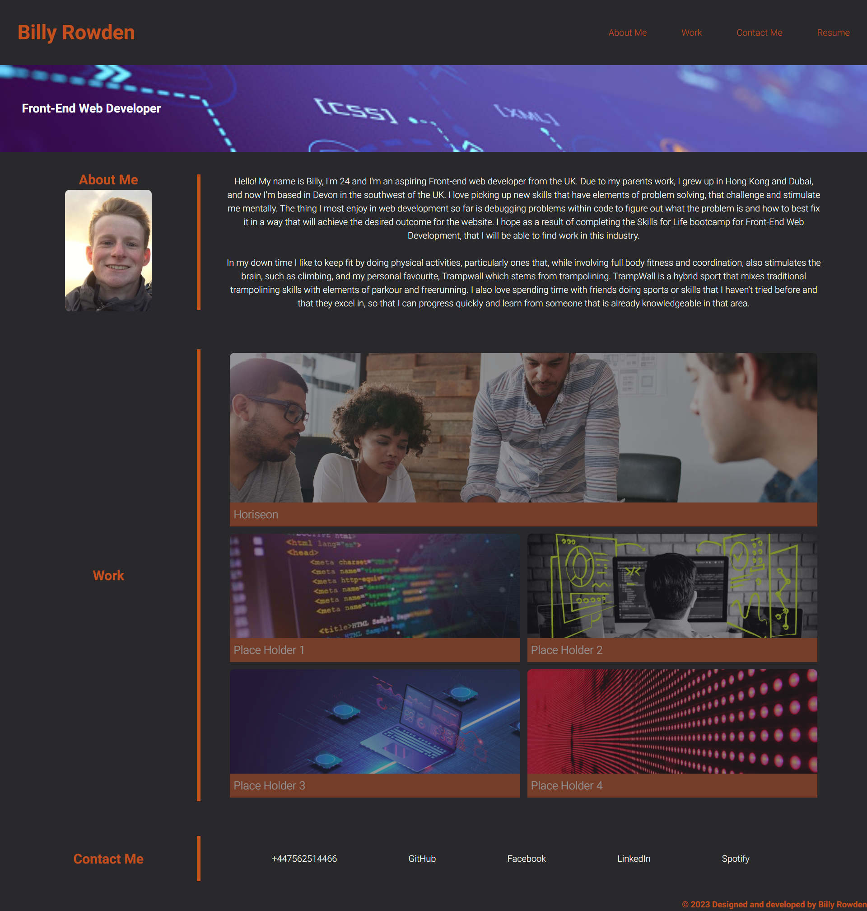

# Portfolio

## Creating a Portfolio web page for projects that I have worked on. 

## Description 

What I have done in this project:

- HTML elements have been used following a logical structure independent of styling and positioning
- Images contain accessible alt attributes
- Title elements contain a concise, descriptive title
- When the page is loaded the page presents my name, a photo of me, and links to sections about me, my work, and how to contact me
- By clicking any of the links in the navigation is clicked then the UI scrolls to the corresponding section
- The section including work that I have done, contains titled images of applications that I have worked onn
- The first application I worked on has an image that is bigger than the other images (which are currently placeholder images for  future projects)
- By clicking the images of the applications in the work section, the user is taken to that deployed application
- If the page is resized or viewed on various screens and devices then the layout is responsive and adapts to my viewport

In order so that:

- I have a portfolio webpage that I can use to show the user previous applications that I have worked on
- People visiting my webpage can find ways to contact me or view my social media profiles

This challenge was an exciting way to show off what I've learnt so far in this bootcamp, and an opportunity to work with other students to trouble shoot issues that we were having, and learning how to work through those problems together. By working on this project, I feel I have gained a far better understanding of how to use styles like flexbox and grids.

## Table of Contents

* [Deployment](#Deployment)
* [Usage](#Usage)
* [Credits](#Credits)
* [Badges](#Badges)
* [Features](#Features)
* [Contributions](#Contributions)

## Deployment

Application deployed at the live GitHub URL: https://billy-rowden.github.io/Portfolio/ .

## Usage 

A webpage for my portfolio displaying web-development projects that I have completed.

The following image displays the web application's appearance after following the stated assessment criteria:

By selecting any of the links titled "About me", "Work", and "Contact Me" located in the top right of the webpage, the user will be directed to the matching sections located elsewhere on the webpage. By selecting the link titled "Resume", the user will be directed to my CV in a new tab.

## Credits

The original starter code - Courtesy of EdX Bootcamps

Study groups with Davou Jobbi, Andrea Fontana, Thomas Jack, Lauren eaton, Mirian tomani held to help understand, troubleshoot and debug each others code.

## Badges

## Features

This is a basic webpage, however there are page links and text hover features that display basic descriptors for the images. There are also image hover features so that the images in the work section become clearer when the user hovers over them, and the cursor becomes a pointer while hovering over these boxes. 

## Contributions

No other contributors.
